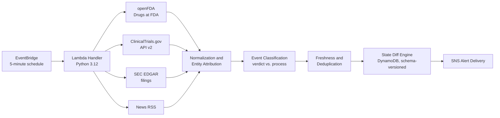

# Biotech Event Intelligence Platform

A serverless AWS system that monitors FDA regulatory activity, clinical trial updates, SEC filings, and financial news in real time for a portfolio of tracked biotech/pharma catalysts — and alerts only when something genuinely new and relevant happens.

> **Note on this repository:** this is a portfolio write-up of an actively developed, production financial/regulatory event-monitoring system. The production source code, exact classification rules, and full tracked-entity configuration are kept private. This README documents the architecture, the engineering problems solved, and the testing approach. Happy to walk through implementation details in an interview.

## SMS Use & Consent

This system is built, operated, and used solely by the author for personal
alerts. All SMS messages are sent to a single phone number belonging to the
account owner, who is also the sole subscriber to the underlying AWS SNS
topic — no third parties send, receive, or are billed for messages.
Estimated volume: roughly 2-10 messages per day, sent only when a tracked
regulatory or clinical trial event fires. Opt-in and opt-out are both
managed directly by the account owner through AWS SNS subscription
management.

## Problem

Biotech stocks move sharply on discrete, often poorly-telegraphed events: an FDA approval or rejection, a clinical trial readout, an SEC filing disclosing a regulatory update, a news report ahead of an official filing. These events come from independent, differently-structured sources (a REST API, a filings index, an RSS feed), on no fixed schedule, and the same underlying event is often reported multiple times by multiple sources with different timing and framing. A monitoring system for this has to solve for *signal*, not just *coverage* — most of the raw feed volume is noise, restatement, or boilerplate.




Runs as a single AWS Lambda function on a 5-minute EventBridge schedule, polling four independent data sources per tracked drug, and persisting state in DynamoDB between cycles so that only genuinely *new* information triggers a notification.

**Pipeline stages:**

- **Ingestion** — parallel calls to openFDA, ClinicalTrials.gov, SEC EDGAR, and news, each with independent retry/timeout handling so a slow or failing source degrades gracefully instead of stalling the cycle.
- **Normalization & entity attribution** — maps raw source content back to the correct tracked drug, including cases where a company has multiple pipeline assets sharing a name, ticker, or SEC CIK, so news/filings about a *different*, untracked product from the same company don't get misattributed.
- **Event classification** — separates content into two tiers (a firm outcome — approval, rejection, trial readout — vs. an informational process update), scoped at the paragraph level so that boilerplate language elsewhere in a long SEC filing can't downgrade a genuine verdict, or bleed a false one onto unrelated content.
- **Freshness & deduplication** — filters out stale re-reporting of old news, and avoids re-alerting on a filing or trial record the system has already seen, while still tolerating legitimate timezone/labeling quirks in how sources timestamp things.
- **State diff engine** — a schema-versioned state machine per tracked drug, stored in DynamoDB, that decides whether a change is alert-worthy, and understands terminal/closed states so a drug that's already fully resolved doesn't keep re-triggering.
- **Alert delivery** — SNS → email, with the triggering source, tier, and published date included.

**Reliability engineering:**

A single degraded HTTP call was originally able to consume an entire Lambda invocation's time budget and starve every other tracked drug in that cycle. This is addressed with layered time-budget checks — per external call, per drug, per source, and per sub-item within a source — so a slow dependency degrades one drug's freshness for one cycle instead of cascading. Processing order is randomized per cycle so that if a budget limit is hit, it isn't always the same drugs that get starved.

## Testing

An offline regression suite (no network, no AWS) covering:
- Event classification and paragraph-scoped boilerplate handling
- Entity attribution and sibling-product exclusion
- Catalyst state-machine transitions and dedup
- Freshness/staleness edge cases
- The time-budget and retry-budget guarantees described above

Plus a live smoke-test mode that runs the real ingestion/classification code against live data sources for manual verification. The suite runs in under a second and gates every change before it ships.

## Sample alert (illustrative — not a real tracked event)

```
Subject: [Catalyst Tracker] URGENT — Acme Therapeutics (ACME) — XYZ-101

[VERDICT] FDA Approves XYZ-101 for Relapsed/Refractory Indication
Source: SEC 8-K
Published: 2026-03-14
Link: [redacted]
```

## Tech stack

Python 3.12 · AWS Lambda · Amazon DynamoDB · Amazon SNS · Amazon EventBridge · AWS SAM/CloudFormation


## Author

Kevin Greegary — [LinkedIn](https://www.linkedin.com/in/kevin-greegary-547885324/) · [GitHub](https://github.com/K3v1njk)
